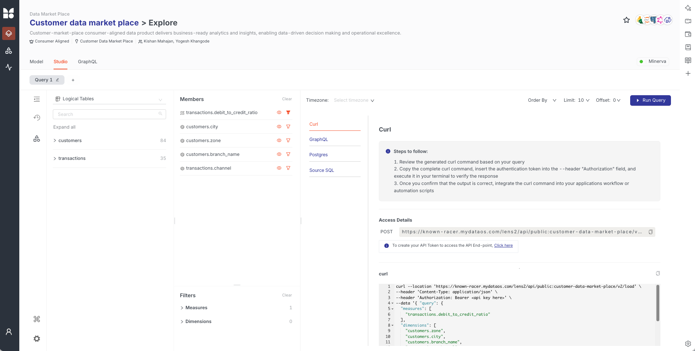
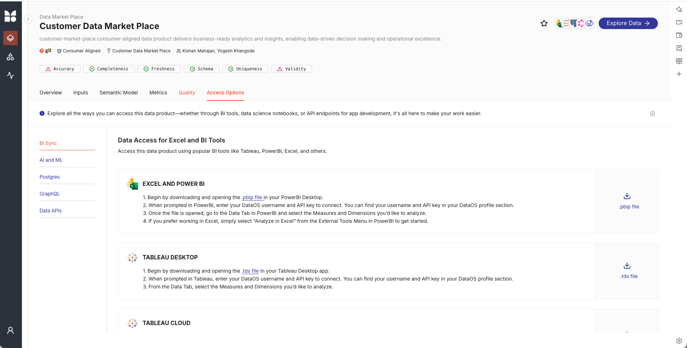

# Customer Data Market Place

## 📋 Overview

The Customer Data Market Place is a comprehensive data platform that transforms raw customer and transaction data from source systems (Snowflake, BigQuery) into business-ready analytics and insights. This platform enables data-driven decision making, customer analytics, and operational excellence through clean, aggregated, and accessible data products.

---

## 🚀 Quick Build APIs: Govern & Secure

### The Story: From Idea to Production API in Minutes

Imagine you need to expose customer transaction insights via an API for your mobile app. Traditionally, this would take weeks: setting up infrastructure, writing code, implementing security, testing, and deploying. With the Customer Data Market Place platform, you can **build, govern, and secure APIs in minutes**.

### ⚡ Quick Build Process

**Step 1: Define Your API** (2 minutes)
```yaml
# Create: activation/data-apis/lens-talos/apis/debit-credit-ratio.yaml
urlPath: /debit_credit_ratio_api
description: Get customer transaction debit to credit ratio analysis
source: customer_data_market_place
```

**Step 2: Write Your Query** (5 minutes)
```sql
-- Create: activation/data-apis/lens-talos/apis/debit-credit-ratio.sql
SELECT 
  customers.zone,
  customers.city,
  customers.branch_name,
  transactions.channel,
  MEASURE(transactions.debit_to_credit_ratio)
FROM customers
CROSS JOIN transactions
GROUP BY 1,2,3,4
```

**Step 3: Deploy** (1 minute)
```bash
# Deploy the Talos service
dataos-ctl apply -f config-talos-lens-service.yaml
```

**Result:** Your API is live at `/talos/public:credit-debit-ratio-api/debit_credit_ratio_api` ✨

### 🛡️ Built-in Governance

**Automatic Governance Features:**
- ✅ **Data Lineage Tracking:** Every API automatically tracks data sources and transformations

- ✅ **Metadata Cataloging:** APIs are automatically cataloged and discoverable

- ✅ **Version Control:** All API definitions are version-controlled in Git

- ✅ **Change Management:** Deployments require approval workflows

- ✅ **Usage Monitoring:** Track API usage, performance, and errors automatically

**Example:** When you create an API, the platform automatically:
- Scans and catalogs the API definition
- Links it to source data products
- Tracks dependencies and impacts
- Monitors usage patterns

### 🔒 Enterprise Security

**Multi-Layer Security Architecture:**

1. **Authentication Layer**
   - Integrated with DataOS Heimdall authentication
   - API keys and token-based access
   - Single Sign-On (SSO) support

2. **Authorization Layer**
   - Role-based access control (RBAC)
   - User group permissions (`user_groups.yml`)
   - Fine-grained access policies

3. **Data Security**
   - Encrypted credentials (Instance Secrets)
   - Row-level security via Lens segments
   - Column-level masking for sensitive data
   - Audit logging for all data access

4. **Network Security**
   - Ingress authentication enabled
   - HTTPS/TLS encryption
   - Network isolation and firewalls

**Security Example:**
```yaml
# In config.yaml - Source access control
sources:
  - name: customer_data_market_place
    type: lens
    lensName: 'public:customer-data-market-place'
    # Automatically inherits Lens security policies
```

### 📊 Governance Dashboard

**What Gets Governed:**

- **API Definitions:** All APIs are versioned and tracked

- **Data Access:** Who accesses what data, when, and how

- **Data Quality:** Automated quality checks before data reaches APIs

- **Performance:** API response times and throughput monitoring

- **Compliance:** Audit trails for regulatory compliance

### 🎯 Real-World Example: Debit-Credit Ratio API

**The Journey:**

1. **Business Need:** Mobile app needs real-time debit-to-credit ratio by branch

2. **Quick Build:** Created API in 8 minutes using existing Lens model

3. **Governance:** Automatically cataloged, versioned, and tracked

4. **Security:** Applied user group permissions, enabled authentication

5. **Deploy:** One command deployment with automatic monitoring

**The Result:**

- ✅ API live in production

- ✅ Secure access with authentication

- ✅ Usage tracked and monitored

- ✅ Data quality validated

- ✅ Full audit trail maintained

### 🔄 Continuous Governance

**Ongoing Governance Features:**

- **Automated Scanning:** Metadata scanners keep catalog up-to-date

- **Quality Monitoring:** Data quality checks run automatically

- **Access Reviews:** Regular access permission audits

- **Performance Optimization:** Automatic query optimization

- **Compliance Reporting:** Built-in compliance dashboards

### 💡 Best Practices

1. **Start with Lens Models:** Build semantic models first, then expose via APIs
2. **Use User Groups:** Define access policies in `user_groups.yml`
3. **Enable Authentication:** Always require authentication for production APIs
4. **Monitor Usage:** Track API performance and usage patterns
5. **Version Control:** Keep all API definitions in Git
6. **Document Everything:** Use clear descriptions and metadata

---

## 🎨 Semantic Model Studio: Direct API Creation

### Visual API Building with Measures & Dimensions

The **Lens Studio** interface provides a visual, no-code way to build APIs directly from your semantic model. Simply select measures and dimensions, and instantly generate GraphQL, REST, or cURL APIs with built-in governance and security.



*Lens Studio showing measure and dimension selection with direct API generation*

### 📊 Step-by-Step: Create GraphQL API in Studio

#### **Step 1: Access Lens Studio**
Navigate to your data product in Data Market Place:
```
https://known-racer.mydataos.com/dph/explore/customer-data-market-place-dp/public:customer-data-market-place/studio
```

#### **Step 2: Select Measures & Dimensions**

**Available Logical Tables:**

- `customers` (84 fields available)
- `transactions` (35 fields available)

**Select Your Measures:**

- ✅ `transactions.debit_to_credit_ratio` - Calculated ratio metric

**Select Your Dimensions:**

- ✅ `customers.zone` - Geographic zone

- ✅ `customers.city` - City location

- ✅ `customers.branch_name` - Branch name

- ✅ `transactions.channel` - Transaction channel

#### **Step 3: Configure Query**
- **Order By:** Select sorting preferences
- **Limit:** Set to 10 (or your preferred limit)
- **Offset:** Set to 0 for pagination
- Click **"► Run Query"** to preview results

#### **Step 4: Generate GraphQL API**

1. Click on the **"Integration"** tab
2. Select **"GraphQL"** sub-tab
3. The platform automatically generates:
   - GraphQL schema
   - Query structure
   - Endpoint URL
   - Authentication headers

**Generated GraphQL Endpoint:**
```
https://known-racer.mydataos.com/lens2/api/public:customer-data-market-place/v2/graphql
```

**Example GraphQL Query:**
```graphql
query {
  load(
    query: {
      measures: ["transactions.debit_to_credit_ratio"]
      dimensions: [
        "customers.zone",
        "customers.city",
        "customers.branch_name",
        "transactions.channel"
      ]
    }
    limit: 10
    offset: 0
  ) {
    data
    meta
  }
}
```

#### **Step 5: Secure & Govern**

**Built-in Security:**

- ✅ **Authentication Required:** All API calls require Bearer token

- ✅ **Authorization:** Respects user group permissions from `user_groups.yml`

- ✅ **Row-Level Security:** Automatically applies Lens segment filters

- ✅ **Column Masking:** Sensitive columns masked based on user permissions

**Built-in Governance:**

- ✅ **Automatic Cataloging:** API endpoint automatically registered

- ✅ **Usage Tracking:** All API calls logged and monitored

- ✅ **Data Lineage:** Tracks from API → Lens → Source tables

- ✅ **Version Control:** GraphQL schema versioned with Lens model

### 🔄 Alternative API Formats

The Studio interface supports multiple API formats:



*Multiple API access options available in Lens Studio: cURL, GraphQL, Postgres, and Source SQL*

#### **1. REST API (cURL)**
```bash
curl --location 'https://known-racer.mydataos.com/lens2/api/public:customer-data-market-place/v2/load' \
--header 'Content-Type: application/json' \
--header 'Authorization: Bearer <api key here>' \
--data '{
    "query": {
        "measures": ["transactions.debit_to_credit_ratio"],
        "dimensions": [
            "customers.zone",
            "customers.city",
            "customers.branch_name",
            "transactions.channel"
        ]
    }
}'
```

#### **2. GraphQL**
- Full GraphQL schema support
- Introspection queries available
- Type-safe queries with autocomplete

#### **3. Postgres**
- Direct SQL access via Postgres protocol
- Compatible with BI tools (Tableau, PowerBI, etc.)
- Standard SQL queries supported

#### **4. Source SQL**
- View the underlying SQL query
- Understand data transformations
- Optimize query performance

### 🎯 Real-World Workflow

**Scenario:** Business analyst needs debit-to-credit ratio by branch for a dashboard

1. **Open Studio** → Navigate to Customer Data Market Place

2. **Select Fields** → Choose measure and dimensions (2 minutes)

3. **Preview Data** → Run query to verify results (1 minute)

4. **Generate API** → Click Integration → GraphQL (30 seconds)

5. **Copy Endpoint** → Use in dashboard application (1 minute)

6. **Deploy** → API is live and secured automatically ✨

**Total Time:** ~5 minutes from idea to production API

### 🔐 Security Features in Studio-Generated APIs

**Automatic Security Application:**

- **User Groups:** API respects `user_groups.yml` permissions

- **Segments:** Row-level filters applied automatically

- **Column Masking:** Sensitive data masked based on user role

- **Audit Logging:** All API calls logged with user, timestamp, query

**Example Security Flow:**
```
User Request → Authentication Check → Authorization Check → 
Segment Filter Applied → Column Masking → Data Returned → Audit Logged
```

### 🚦 Rate Limiting & API Throttling

All APIs in the Customer Data Market Place platform include built-in rate limiting to ensure fair usage, prevent abuse, and maintain system stability.

#### **Rate Limiting Features**

**1. GraphQL API Rate Limits (Lens)**

- **Default Limits:**

  - **Requests per minute:** 100 requests/minute per user
  - **Requests per hour:** 5,000 requests/hour per user
  - **Concurrent requests:** 10 concurrent requests per user

- **User Group Limits:**

  - **Admin users:** 500 requests/minute
  - **Analyst users:** 200 requests/minute
  - **Viewer users:** 100 requests/minute

- **Query Complexity Limits:**

  - Maximum query depth: 10 levels
  - Maximum query cost: 1000 points
  - Maximum result size: 10,000 rows per query

**2. REST API Rate Limits (Talos)**

- **Default Limits:**

  - **Requests per minute:** 60 requests/minute per API key
  - **Requests per hour:** 3,000 requests/hour per API key
  - **Burst capacity:** 20 requests in 10 seconds

- **Service-Level Limits:**

  - Configured per Talos service in `config-talos-lens-service.yaml`
  - Resource limits: CPU (500m) and Memory (512Mi) per service instance
  - Auto-scaling based on load and rate limit thresholds

**3. cURL/HTTP API Rate Limits**

- **Endpoint-Specific Limits:**

  - `/v2/load` endpoint: 100 requests/minute
  - `/v2/sql` endpoint: 50 requests/minute
  - `/v2/graphql` endpoint: 100 requests/minute

- **IP-Based Limits:**

  - 200 requests/minute per IP address
  - 10,000 requests/hour per IP address

**4. Postgres Protocol Rate Limits**

- **Connection Limits:**

  - Maximum 20 concurrent connections per user
  - Connection timeout: 30 seconds idle

- **Query Limits:**

  - 50 queries/minute per connection
  - Maximum query execution time: 5 minutes
  - Maximum result set: 100,000 rows

#### **Rate Limit Headers**

All API responses include rate limit headers:

```http
X-RateLimit-Limit: 100
X-RateLimit-Remaining: 95
X-RateLimit-Reset: 1640995200
X-RateLimit-Used: 5
```

**Header Descriptions:**
- `X-RateLimit-Limit`: Maximum number of requests allowed in the time window
- `X-RateLimit-Remaining`: Number of requests remaining in current window
- `X-RateLimit-Reset`: Unix timestamp when the rate limit resets
- `X-RateLimit-Used`: Number of requests used in current window

#### **Rate Limit Responses**

**When Rate Limit is Exceeded:**
```json
{
  "error": {
    "code": "RATE_LIMIT_EXCEEDED",
    "message": "Rate limit exceeded. Maximum 100 requests per minute.",
    "retryAfter": 30,
    "limit": 100,
    "remaining": 0,
    "resetAt": "2024-01-01T12:01:00Z"
  }
}
```

**HTTP Status Code:** `429 Too Many Requests`

**Response Headers:**
- `Retry-After: 30` - Seconds to wait before retrying

#### **Rate Limit Configuration**

**User Group-Based Limits:**
Configured in `user_groups.yml`:
```yaml
userGroups:
  - name: admin
    api_scopes: ["data", "graphql", "meta"]
    rateLimits:
      requestsPerMinute: 500
      requestsPerHour: 30000
      concurrentRequests: 50
      
  - name: analyst
    api_scopes: ["data", "graphql"]
    rateLimits:
      requestsPerMinute: 200
      requestsPerHour: 10000
      concurrentRequests: 20
      
  - name: viewer
    api_scopes: ["data"]
    rateLimits:
      requestsPerMinute: 100
      requestsPerHour: 5000
      concurrentRequests: 10
```

**Service-Level Limits:**
Configured in `config-talos-lens-service.yaml`:
```yaml
service:
  resources:
    requests:
      cpu: 100m
      memory: 256Mi
    limits:
      cpu: 500m      # Rate limiting based on CPU usage
      memory: 512Mi  # Rate limiting based on memory usage
  replicas: 1       # Horizontal scaling for higher limits
```

#### **Rate Limit Monitoring & Governance**

**Automatic Monitoring:**

- ✅ **Real-time Tracking:** All rate limit violations logged and monitored

- ✅ **Usage Analytics:** Track API usage patterns and peak times

- ✅ **Alerting:** Automatic alerts when rate limits approach thresholds

- ✅ **Dashboard:** Visual dashboard showing rate limit usage by user, API, and time period

**Governance Features:**

- ✅ **Fair Usage Policy:** Ensures fair distribution of API resources

- ✅ **Abuse Prevention:** Protects against API abuse and DDoS attacks

- ✅ **Cost Control:** Prevents runaway costs from excessive API usage

- ✅ **Performance Protection:** Maintains system performance under load

- ✅ **Compliance:** Rate limit logs included in audit trails

#### **Best Practices for Rate Limiting**

1. **Monitor Rate Limit Headers:**
   ```javascript
   // Check rate limit headers before making requests
   const remaining = response.headers['x-ratelimit-remaining'];
   if (remaining < 10) {
     // Implement backoff strategy
     await delay(60000); // Wait 1 minute
   }
   ```

2. **Implement Exponential Backoff:**
   ```javascript
   // Retry with exponential backoff on 429 errors
   if (response.status === 429) {
     const retryAfter = parseInt(response.headers['retry-after'] || '60');
     await delay(retryAfter * 1000);
     // Retry request
   }
   ```

3. **Use Caching:**

   - Cache API responses to reduce request frequency

   - Implement cache invalidation strategies

   - Use ETags for conditional requests

4. **Batch Requests:**

   - Combine multiple queries into single requests when possible

   - Use GraphQL query batching

   - Leverage bulk endpoints

5. **Request Higher Limits:**

   - Contact data product owner for limit increases

   - Provide business justification for higher limits

   - Monitor usage patterns before requesting increases


#### **Rate Limit Examples**

**Example 1: Checking Rate Limits**
```bash
curl -I https://known-racer.mydataos.com/lens2/api/public:customer-data-market-place/v2/load \
  --header "Authorization: Bearer <token>"

# Response headers:
# X-RateLimit-Limit: 100
# X-RateLimit-Remaining: 99
# X-RateLimit-Reset: 1640995200
```

**Example 2: Handling Rate Limit Exceeded**
```bash
# Request that exceeds rate limit
curl https://known-racer.mydataos.com/lens2/api/public:customer-data-market-place/v2/load \
  --header "Authorization: Bearer <token>"

# Response (429):
# {
#   "error": {
#     "code": "RATE_LIMIT_EXCEEDED",
#     "message": "Rate limit exceeded",
#     "retryAfter": 30
#   }
# }
```

**Example 3: GraphQL with Rate Limits**
```graphql
# GraphQL queries respect complexity-based rate limits
query {
  load(
    query: {
      measures: ["transactions.debit_to_credit_ratio"]
      dimensions: ["customers.zone", "customers.city"]
    }
    limit: 100  # Respects maximum result size limits
  ) {
    data
    meta {
      rateLimit {
        limit
        remaining
        resetAt
      }
    }
  }
}
```

### 📈 Governance Features

**What Gets Governed Automatically:**

- ✅ **API Schema:** GraphQL schema versioned with Lens model

- ✅ **Query Patterns:** Common queries tracked and optimized

- ✅ **Data Access:** Who queries what data, when, and how often

- ✅ **Performance:** Query execution times and resource usage

- ✅ **Compliance:** Full audit trail for regulatory requirements

### 💡 Pro Tips

1. **Start Simple:** Begin with basic measures and dimensions, then add complexity
2. **Use Filters:** Apply filters in Studio to test before generating API
3. **Test in Studio:** Always preview results before copying API code
4. **Save Perspectives:** Save frequently used query combinations
5. **Monitor Usage:** Check API usage patterns in governance dashboard
6. **Optimize Queries:** Use Source SQL view to understand query performance

---

## 🏗️ Platform Architecture

```
customer-market-place/
│
├── 📦 Phase 1: Foundation & Infrastructure Setup
│   ├── 1.1-instance-secrets/          → Secure credential management
│   ├── 1.2-depot/                      → Data source connections
│   ├── 1.3-cluster/                    → Query processing engine
│   └── 1.4-scanner/                    → Metadata discovery
│
├── 🔄 Phase 2: Data Ingestion & Processing
│   ├── 2.1-customers/                  → Customer data pipeline
│   └── 2.2-transactions/                → Transaction data pipeline
│
└── 🎯 Phase 3: Data Product & Activation
    └── 3.1-customer-market-place/       → Business-ready data product
```

---

## 📂 Detailed Structure

### **Phase 1: Foundation & Infrastructure** 🔧

#### `1.1-instance-secrets/` - Security & Credentials

**Purpose:** Securely stores authentication credentials for data sources

- `config-bigquery-secrets.yaml` - Google BigQuery access credentials

- `config-snowflake-secrets.yaml` - Snowflake database credentials

**Business Value:** Ensures secure, encrypted storage of sensitive credentials without exposing them in code or configuration files.

---

#### `1.2-depot/` - Data Source Connections

**Purpose:** Establishes connections to external data sources

- `config-bigquery-depot.yaml` - Connection to BigQuery data warehouse

- `config-snowflake-depot.yaml` - Connection to Snowflake data warehouse

**Business Value:** Provides a unified interface to access data from multiple sources without moving data, enabling real-time analytics.

---

#### `1.3-cluster/` - Query Processing Engine

**Purpose:** Configures the Minerva cluster for fast SQL query processing

- `config-minerva-cluster.yaml` - Query engine configuration

**Business Value:** Enables fast, scalable query processing for analytics and reporting workloads.

---

#### `1.4-scanner/` - Metadata Discovery

**Purpose:** Automatically discovers and catalogs data structures from source systems

- `config-bigquery-scanner.yaml` - Scans BigQuery tables and schemas

- `config-snowflake-scanner.yaml` - Scans Snowflake tables and schemas

- `confif-data-product-scanner.yaml` - Scans data product metadata

**Business Value:** Automatically maintains an up-to-date catalog of available data, making it easy to discover and understand data assets.

---

### **Phase 2: Data Ingestion & Processing** 🔄

#### `2.1-customers/` - Customer Data Pipeline

**Purpose:** Processes and transforms raw customer data into analytics-ready format

**Structure:**
```
2.1-customers/
├── build/
│   ├── data-processing/          → Data transformation workflows
│   │   └── config-customers-flare.yaml
│   ├── profile/                  → Data profiling and statistics
│   │   └── config-customer-profile.yaml
│   └── quality/                  → Data quality checks and validation
│       └── config-customers-quality.yaml
└── deploy/
    ├── config-customers-bundle.yaml    → Deployment bundle
    ├── config-customers-dp.yaml        → Data product definition
    ├── pipeline.yaml                   → Pipeline orchestration
    └── scanner.yaml                    → Metadata scanner config
```

**Business Value:**

- **Data Processing:** Cleanses, transforms, and standardizes customer data

- **Data Profiling:** Provides statistics and insights about data quality

- **Data Quality:** Validates data completeness, accuracy, and consistency

- **Output:** Clean customer dataset ready for analytics (`icebase:data_market_place:customers`)

---

#### `2.2-transactions/` - Transaction Data Pipeline
**Purpose:** Processes and transforms raw transaction data into analytics-ready format

**Structure:**
```
2.2-transactions/
├── build/
│   ├── data-processing/          → Data transformation workflows
│   │   └── config-transactions-flare.yaml
│   └── quality/                  → Data quality checks
│       └── config-transactions-quality.yaml
└── deploy/
    ├── config-transactions-bundle.yaml  → Deployment bundle
    ├── config-transactions-dp.yaml      → Data product definition
    ├── pipeline.yaml                    → Pipeline orchestration
    └── scanner.yaml                     → Metadata scanner config
```

**Business Value:**

- Processes transaction data including debits, credits, channels, and timestamps
- Validates transaction integrity and completeness

- **Output:** Clean transaction dataset ready for analytics (`icebase:data_market_place:transactions`)

---

### **Phase 3: Data Product & Activation** 🎯

#### `3.1-customer-market-place/` - Business-Ready Data Product
**Purpose:** Combines customer and transaction data into a unified, business-ready data product with multiple consumption interfaces

**Structure:**
```
3.1-customer-market-place/
│
├── build/                        → Data product model definition
│   ├── access-control/           → User access permissions
│   └── customer-market-place/
│       ├── deployment.yaml        → Deployment configuration
│       └── model/
│           ├── sqls/             → SQL query definitions
│           │   ├── customers.sql
│           │   └── transactions.sql
│           ├── tables/           → Logical table definitions
│           │   ├── customers.yaml
│           │   └── transactions.yaml
│           ├── views/            → Business metrics and views
│           │   └── metrics.yml
│           └── user_groups.yml  → User group definitions
│
├── deploy/                       → Data product deployment
│   ├── config-customer-data-market-place-bundle.yaml
│   ├── config-customer-data-market-place-dp.yaml
│   └── config-data-product-scanner.yaml
│
└── activation/                   → Consumption interfaces
    ├── data-apis/                → REST API endpoints
    │   ├── lens-talos/           → Talos API service
    │   │   ├── apis/
    │   │   │   ├── debit-credit-ratio.sql    → API query
    │   │   │   └── debit-credit-ratio.yaml   → API definition
    │   │   ├── config-talos-lens-service.yaml → Service config
    │   │   └── config.yaml                    → App config
    │   └── README.md
    ├── custom-application/       → Custom applications
    │   └── README.md
    └── notebook/                 → Jupyter notebooks
        └── README.md
```

**Business Value:**

- **Unified Data Model:** Combines customer and transaction data into a single, consistent view

- **Business Metrics:** Pre-defined metrics like debit-to-credit ratios, customer segmentation

- **Multiple Access Methods:**

  - **Lens (Semantic Layer):** Business-friendly interface for BI tools and dashboards

  - **Talos API:** RESTful API for programmatic access (e.g., `/debit_credit_ratio_api`)

  - **REST API:** Direct data access endpoints

- **Access Control:** Role-based permissions ensuring data security

---

## 🎯 Key Business Capabilities

### 1. **Customer Analytics**
- Customer segmentation by zone, city, branch
- Customer risk profiling
- Customer lifecycle analysis

### 2. **Transaction Analysis**
- Debit-to-credit ratio analysis
- Transaction channel performance
- Payment pattern analysis

### 3. **Operational Insights**
- Branch-level performance metrics
- Geographic performance analysis
- Channel effectiveness tracking

### 4. **Data Quality Assurance**
- Automated data quality checks
- Data profiling and statistics
- Data completeness validation

---

## 📊 Data Products

### **Customers Data Product** (`customers-v2-dp`)

- **Tier:** Source Aligned

- **Use Case:** Customer Data Market Place

- **Output:** `icebase:data_market_place:customers`

### **Transactions Data Product** (`transactions-dp`)

- **Tier:** Source Aligned

- **Use Case:** Customer Data Market Place

- **Output:** `icebase:data_market_place:transactions`

### **Customer Data Market Place** (`customer-data-market-place-dp`)

- **Tier:** Consumer Aligned
- **Use Case:** Customer Data Market Place
- **Consumption Interfaces:**

  - Lens: `public:customer-data-market-place`
  - Talos API: `credit-debit-ratio-api`
  - REST API: Available via DataOS REST endpoints

---

## 🔐 Access & Security

- **User Groups:** Defined in `user_groups.yml`
- **Access Control:** Role-based permissions in `access-control/`
- **Authentication:** Integrated with DataOS authentication system

---

## 📝 Notes for Business Users

1. **Data Freshness:** Data is processed on a scheduled basis (check pipeline configurations)
2. **Data Quality:** Automated quality checks ensure data reliability
3. **API Access:** Use Talos APIs for programmatic access to specific metrics
4. **BI Tools:** Connect BI tools (Tableau, PowerBI, etc.) to the Lens semantic layer
5. **Support:** Contact data product owners for questions or issues

---

## 👥 Ownership

- **Owner:** Soumya Dutta
- **Developer:** yogesh khangode
- **Source Code:** [Bitbucket Repository](https://bitbucket.org/rubik_/npa-early-warning-system/src/main/customer-market-place)

---

*Last Updated: 2024*

